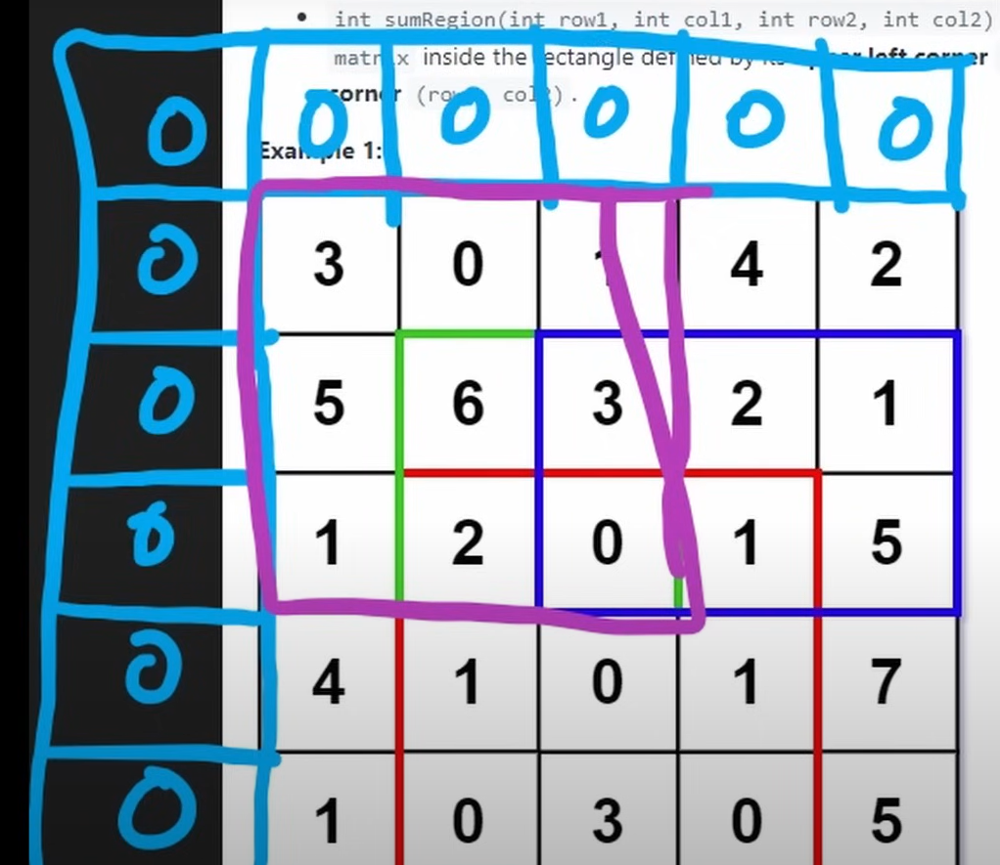
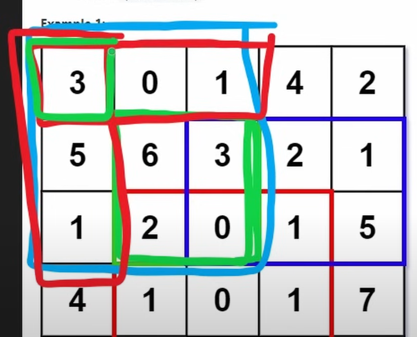

# Range Sum Query 2D Immutable

- 🧩 Problem link: [Leetcode](https://leetcode.com/problems/range-sum-query-2d-immutable/)
- 🚦 Difficulty: 🟡 Medium

## 💡 Approach

1. **Preprocessing (constructor):**

   - Build an auxiliary matrix `sumMatrix` with one extra row and column (initialized with zeros) to do not need `if`s statements for out of bounds edge cases.
   - Each cell `(r+1, c+1)` in `sumMatrix` stores the sum of all elements in the rectangle from `(0,0)` to `(r,c)` of the original matrix.
   - This is computed by keeping a running row sum and adding the value from the row above.

   

2. **Query (sumRegion):**

   - To get the sum of any submatrix `(row1, col1)` to `(row2, col2)`, use the inclusion–exclusion principle:

     ```cpp
     result = bottomRight - above - left + topLeft
     ```

     where:
     

     - `bottomRight = sumMatrix[row2+1][col2+1]` -> green area
     - `above = sumMatrix[row1][col2+1]` -> red area left-right (3, 0, 1)
     - `left = sumMatrix[row2+1][col1]` -> red area top-down (3,5,1)
     - `topLeft = sumMatrix[row1][col1]` -> green area top-left (3)

## 🕒 Time and Space Complexity

- Time: O(1) for each query
- Space: O(m \* n)

> Where `m` is the number of rows and `n` is the number of columns in the matrix

## ✅ Solution

```cpp
class NumMatrix
{
public:
    vector<vector<int>> sumMatrix;
    NumMatrix(vector<vector<int>> &matrix)
    {
        int COLS = matrix[0].size(), ROWS = matrix.size();
        sumMatrix = vector<vector<int>>(ROWS + 1, vector<int>(COLS + 1, 0));

        for (int r = 0; r < ROWS; r++)
        {
            int rowSum = 0;
            for (int c = 0; c < COLS; c++)
            {
                rowSum += matrix[r][c];
                int above = sumMatrix[r][c + 1];
                sumMatrix[r + 1][c + 1] = rowSum + above;
            }
        }
    }

    int sumRegion(int row1, int col1, int row2, int col2)
    {
        row1++;
        col1++;
        row2++;
        col2++;
        int bottomRight = sumMatrix[row2][col2];
        int above = sumMatrix[row1 - 1][col2];
        int left = sumMatrix[row2][col1 - 1];
        int topLeft = sumMatrix[row1 - 1][col1 - 1];
        return bottomRight - above - left + topLeft;
    }
};
```
