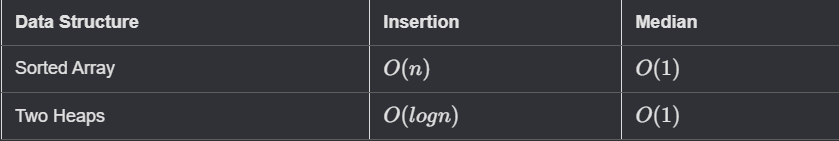

# Find Median From Data Stream

- 🧩 Problem link: [Leetcode](https://leetcode.com/problems/find-median-from-data-stream/)
- 🚦 Difficulty: 🔴 Hard

## Purpose

The **median** is the middle value in an ordered integer list. If the size of the list is even, there is no middle value, and the median is the mean of the two middle values.

- For example, for `arr = [2,3,4]`, the median is `3`.
- For example, for `arr = [2,3]`, the median is `(2 + 3) / 2 = 2.5`.

**Implement the MedianFinder class:**

- `MedianFinder()` initializes the MedianFinder object.
- `void addNum(int num)` adds the integer num from the data stream to the data structure.
- `double findMedian()` returns the median of all elements so far. Answers within `10^-5` of the actual answer will be accepted.

### Example 1:

#### Input

```cpp
["MedianFinder", "addNum", "addNum", "findMedian", "addNum", "findMedian"]
[[], [1], [2], [], [3], []]
```

#### Output

```cpp
[null, null, null, 1.5, null, 2.0]
```

#### Explanation

```cpp
MedianFinder medianFinder = new MedianFinder();
medianFinder.addNum(1);    // arr = [1]
medianFinder.addNum(2);    // arr = [1, 2]
medianFinder.findMedian(); // return 1.5 (i.e., (1 + 2) / 2)
medianFinder.addNum(3);    // arr[1, 2, 3]
medianFinder.findMedian(); // return 2.0
```

## Concept

Thus far, we have seen how we can solve problems using a single heap. But sometimes the most efficient solution requires us to use two heaps: both a min and max heap.

Let's take a look at a problem that can be solved using the two heaps approach.

Finding the median of a continuous stream of numbers is a good example.

> Q: Implement a Median finder, where new values are inserted into the set, and you have to getMedian from that set.

**The naive approach here would be to implement this using a sorted array.**

- While we could compute the median in `O(1)` time, insertion would take `O(n)` time as we would need to shift elements around to maintain the sorted property.
- Using two heaps allows us to still compute the median in `O(1)` time, but now we can also insert elements in `O(logn)` time.



### Two Heaps Approach

We will maintain a **max-heap** and a **min-heap**.

1. In the max-heap, we store the smaller half of values from the stream.
2. Conversely, in the min-heap, we store the larger half of values from the stream.

To ensure each value goes in the correct heap and both heaps are roughly the same size, we might need to shift some elements around.

1. The max-heap will store the smaller half of the values. Thus, the top of the max-heap will be the largest value in the smaller half.
2. The min-heap will store the larger half of the values. Thus, the top of the min-heap will be the smallest value in the larger half.

This would mean that the largest value in our max-heap will be smaller than the smallest value in our min-heap. Thus, the median can be calculated by just retrieving the min and the max values from our respective heaps.

If the number of elements in our array is even, both of our heaps will have an equal number of elements. If we have an odd number of elements, one heap's size will be greater than the other. At any given iteration, the sizes of both heaps should only differ by at most 1 element.

### Examples

#### Odd number of elements

If the number of elements in is odd, the median resides in whichever heap has an extra element.


#### Even number of elements

If there are an even number of elements in both the heaps, the median is found by averaging the max from the max-heap and the min from the min-heap.


### Implementation

#### The initial setup

We will start by initializing two heaps in the `Median` class, `small` and `large`, denoting our max and min heap, respectively.

```cpp
#include <vector>
#include <queue>

using std::vector;
using std::priority_queue;
using std::greater;


class Median {
public:
    priority_queue<int> small_; // max heap
    priority_queue<int, vector<int>, greater<int>> large_; // min heap

    Median() {}
};
```

#### Insertion

Insertion can be performed in `O(logn)` time into the heap.

> In some languages, max heaps are not supported natively. We can get the behavior of a max heap by using a comparator. In Python, we can multiply all of the numbers by -1 to get the desired result

Rather than trying to identify which heap to insert the new element into, we will always insert into the max-heap. It's much easier to just rebalance the heaps after the insertion.

1. Insert the new element into the max-heap.
2. If the max from the max-heap is larger than the min-heap, we will shift it to the min-heap.
3. If the size of the two heaps differ by more than 1, we will transfer elements between the two heaps to ensure the size property.

```cpp
void insert(int num) {
    // Push to the max heap and swap with min heap if needed.
    small_.push(num);
    if (!small_.empty() && !large_.empty() && small_.top() > large_.top()) {
        large_.push(small_.top());
        small_.pop();
    }
    // Handle uneven size
    if (small_.size() > large_.size() + 1) {
        large_.push(small_.top());
        small_.pop();
    }
    if (large_.size() > small_.size() + 1) {
        small_.push(large_.top());
        large_.pop();
    }
}
```

#### Get Median

If the number of elements is odd, and the `maxHeap` is larger than the `minHeap`, the `median` is max in the `maxHeap`. If the `minHeap` is larger in size than the `maxHeap`, the `median` is the min in `minHeap`. If the number of elements is even, the `median` is the average of min and max from the respective heaps.

```cpp
double getMedian() {
    if (small_.size() > large_.size()) {
        return (double) small_.top();
    } else if (large_.size() > small_.size()) {
        return (double) large_.top();
    }
    // Even # of elements, return avg of two middle nums
    return (double)(small_.top() + large_.top()) / 2.0;
}
```

## 🕒 Time and Space Complexity

- Time:
  - Insertion: O(logn)
  - Calculating median: O(1)
- Space: O(n)

> Where `n` is the number of elements in the stream

## ✅ Solution

```cpp
class MedianFinder
{
public:
    priority_queue<int> small;                            // maxHeap
    priority_queue<int, vector<int>, greater<int>> large; // minHeap

    MedianFinder() {}

    void addNum(int num)
    {
        small.push(num);
        if (!large.empty() && small.top() > large.top())
        {
            large.push(small.top());
            small.pop();
        }

        // ALSO - can do this instead lines above
        // check if the curr num should be in large heap or in small heap from beginning

        // if (!large.empty() && num > large.top()) {
        //     large.push(num);
        // } else {
        //     small.push(num);
        // }

        // Balancing heaps
        if (small.size() > large.size() + 1)
        {
            large.push(small.top());
            small.pop();
        }
        else if (large.size() > small.size() + 1)
        {
            small.push(large.top());
            large.pop();
        }
    }

    double findMedian()
    {
        // odd len case
        if (small.size() > large.size())
        {
            return (double)small.top();
        }
        else if (large.size() > small.size())
        {
            return (double)large.top();
        }

        // even len case
        return (double)(small.top() + large.top()) / 2.0;
    }
};
```
